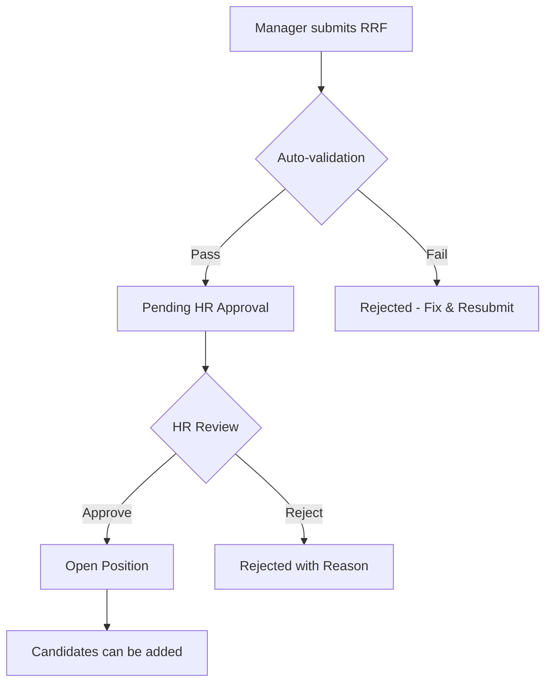
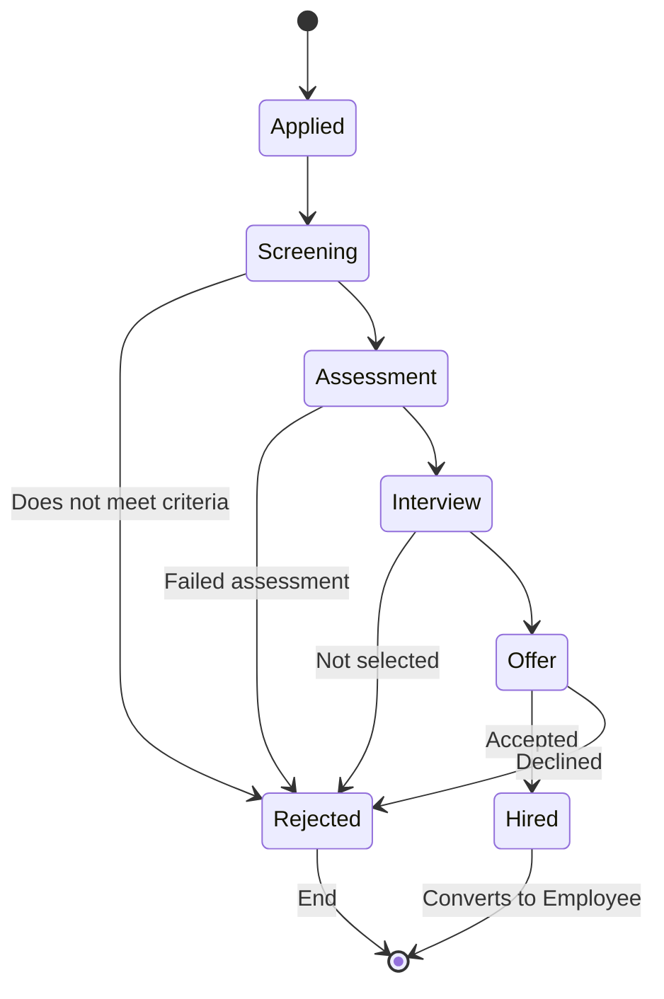
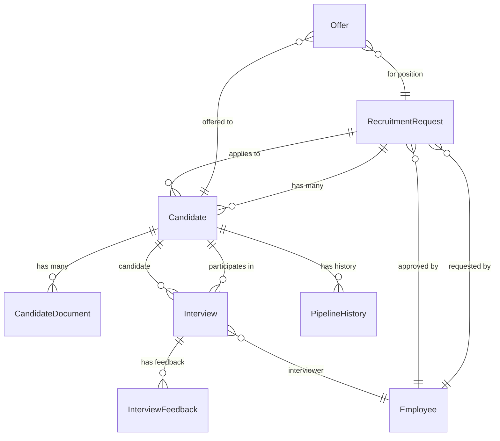

# Recruitment Documentation Action Plan

**Based on:** [Recruitment Documentation Review](RECRUITMENT_DOCUMENTATION_REVIEW.md)  
**Date:** January 5, 2026  
**Overall Grade:** 7/10  
**Priority:** High - Documentation gaps blocking effective implementation

---

## Executive Summary

The recruitment documentation review identified **strong strategic planning** but **critical operational gaps**. This action plan prioritizes the 12 key recommendations into a practical implementation timeline.

**Bottom Line:** With 2-3 days of focused effort, we can address the critical gaps. Full documentation maturity will take 2-3 weeks.

---

## Critical Path (Do First - Week 1)

### 1. Create RECRUITMENT_SYSTEM_OVERVIEW.md ⏱️ 2-3 hours

**Why Critical:** No single document explains what the recruitment module is, what it does, or how it works.

**Content:**
```markdown
# Recruitment System Overview

## What It Is
- Comprehensive recruitment management module
- Manager-initiated recruitment requests (RRF)
- Candidate tracking through pipeline stages
- Interview scheduling and evaluation
- Offer management and onboarding handoff

## Current State
- ✅ Basic RRF submission (implemented)
- ✅ Candidate database (implemented)
- ✅ Pass system for candidates (implemented)
- 🚧 Pipeline management (in progress)
- ⏳ Interview scheduling (planned)
- ⏳ External integrations (planned)

## Architecture Overview
[Diagram showing: RRF → Candidates → Pipeline → Interviews → Offers → Onboarding]

## Key Features by Role
**Managers:** Submit RRF, view pipeline, conduct interviews
**HR:** Approve RRF, manage candidates, generate offers
**Candidates:** View status, upload docs, schedule interviews

## Integration Points
- Onboarding module (handoff when hired)
- Employee module (converts candidate to employee)
- Pass system (candidate and manager passes)
- Notification system (status updates)

## Related Documentation
- [Workflows](RECRUITMENT_WORKFLOWS.md)
- [Data Model](RECRUITMENT_DATA_MODEL.md)
- [API Reference](../api/RECRUITMENT_API_REFERENCE.md)
- [User Guides](../user-guides/)
```

**Deliverable:** Single source of truth for recruitment module  
**Owner:** HR Assistant Agent or Portal Engineer  
**Dependencies:** None

---

### 2. Add Recruitment Workflow Diagrams ⏱️ 1-2 hours

**Why Critical:** Users and developers need to see the process flow visually.

**Create:** `docs/recruitment/RECRUITMENT_WORKFLOWS.md`

**Content:**

Use Mermaid diagrams to show:

1. **RRF Workflow**


2. **Candidate Pipeline Flow**


3. **Interview Scheduling Flow**
4. **Offer Approval Flow**

**Deliverable:** Visual process documentation  
**Owner:** Any team member with Mermaid knowledge  
**Dependencies:** None

---

### 3. Document Recruitment Data Model ⏱️ 2-3 hours

**Why Critical:** Developers cannot implement features without knowing the data structure.

**Create:** `docs/recruitment/RECRUITMENT_DATA_MODEL.md`

**Content:**

```markdown
# Recruitment Data Model

## Entity-Relationship Diagram



## Table Schemas

### recruitment_requests
| Column | Type | Constraints | Description |
|--------|------|-------------|-------------|
| id | UUID | PK | Unique identifier |
| position_title | VARCHAR(200) | NOT NULL | Job title |
| department | VARCHAR(100) | NOT NULL | Department |
| requested_by | UUID | FK(employees) | Manager ID |
| approved_by | UUID | FK(employees) | HR approver |
| status | ENUM | NOT NULL | open/closed/rejected |
| created_at | TIMESTAMP | NOT NULL | Request date |
| approved_at | TIMESTAMP | NULL | Approval date |

### candidates
| Column | Type | Constraints | Description |
|--------|------|-------------|-------------|
| id | UUID | PK | Unique identifier |
| recruitment_request_id | UUID | FK(recruitment_requests) | Position applied to |
| full_name | VARCHAR(200) | NOT NULL | Candidate name |
| email | VARCHAR(255) | NOT NULL, UNIQUE | Contact email |
| phone | VARCHAR(50) | NULL | Contact phone |
| current_stage | ENUM | NOT NULL | Pipeline stage |
| status | ENUM | NOT NULL | active/rejected/hired |
| source | VARCHAR(100) | NULL | How found |
| created_at | TIMESTAMP | NOT NULL | Application date |

### interviews
| Column | Type | Constraints | Description |
|--------|------|-------------|-------------|
| id | UUID | PK | Unique identifier |
| candidate_id | UUID | FK(candidates) | Candidate |
| interviewer_id | UUID | FK(employees) | Interviewer |
| scheduled_at | TIMESTAMP | NOT NULL | Interview time |
| type | ENUM | NOT NULL | phone/video/onsite |
| status | ENUM | NOT NULL | scheduled/completed/cancelled |
| feedback | TEXT | NULL | Interview notes |
| recommendation | ENUM | NULL | hire/maybe/reject |
```

[Continue with remaining tables...]

## Relationships

### RecruitmentRequest → Candidates (One-to-Many)
- One position can have multiple candidates
- Candidates must belong to exactly one position
- Cascade delete: NO (keep historical data)

### Candidate → Documents (One-to-Many)
- Each candidate can upload multiple documents
- Documents cannot exist without a candidate
- Cascade delete: YES (remove docs when candidate deleted)

[Continue with remaining relationships...]

## Example Data

```sql
-- Sample recruitment request
INSERT INTO recruitment_requests VALUES (
  'uuid-1',
  'Senior Software Engineer',
  'Engineering',
  'emp-001',  -- requested by manager
  'emp-hr-001',  -- approved by HR
  'open',
  '2026-01-01 09:00:00',
  '2026-01-02 14:30:00'
);

-- Sample candidate
INSERT INTO candidates VALUES (
  'cand-1',
  'uuid-1',  -- for the above position
  'Jane Doe',
  'jane.doe@example.com',
  '+971501234567',
  'interview',  -- current stage
  'active',
  'LinkedIn',
  '2026-01-05 10:15:00'
);
```
```

**Deliverable:** Complete data model documentation  
**Owner:** Backend developer or Portal Engineer  
**Dependencies:** Access to current database schema

---

### 4. Create GLOSSARY.md ⏱️ 1 hour

**Why Critical:** Inconsistent terminology across documents causes confusion.

**Create:** `docs/GLOSSARY.md`

**Content:**

```markdown
# Recruitment System Glossary

Consistent terminology used across all Secure Renewals HR Portal documentation.

## Recruitment Terms

### RRF (Recruitment Request Form)
- **Full Name:** Recruitment Request Form
- **Also Called:** Recruitment Request, Position Request, Hiring Request
- **Definition:** A formal request submitted by a manager to open a new position
- **Who Uses:** Managers initiate, HR approves
- **Related:** recruitment_requests table

### Candidate
- **Full Name:** Candidate, Job Candidate
- **Not Called:** Applicant (we don't use this term)
- **Definition:** A person who has applied or been invited to apply for a position
- **Who Uses:** HR manages, Managers review
- **Related:** candidates table, Candidate Pass

### Pipeline
- **Full Name:** Recruitment Pipeline, Candidate Pipeline
- **Also Called:** Stages, Workflow
- **Definition:** The series of stages a candidate moves through from application to hiring
- **Stages:** Applied → Screening → Assessment → Interview → Offer → Hired
- **Who Uses:** HR and Managers track progress

### Pipeline Stage
- **Full Name:** Pipeline Stage, Candidate Stage
- **Not Called:** Status (status is different - active/rejected/hired)
- **Definition:** Current step in the recruitment process
- **Values:** 
  - `applied` - Initial application received
  - `screening` - CV/resume under review
  - `assessment` - Skills testing or assignments
  - `interview` - Interview scheduled or completed
  - `offer` - Offer extended
  - `hired` - Offer accepted, moving to onboarding

### Candidate Status
- **Full Name:** Candidate Status
- **Not Called:** Stage (stage is different - pipeline position)
- **Definition:** Overall state of the candidate
- **Values:**
  - `active` - Currently being considered
  - `rejected` - No longer under consideration
  - `hired` - Successfully hired
  - `withdrawn` - Candidate withdrew application

[Continue with all terms...]

## System Terms

### Pass
- **Full Name:** Digital Pass, System Pass
- **Types:** Manager Pass, Candidate Pass, Employee Pass, Onboarding Pass
- **Definition:** A mobile-friendly view with QR code for accessing role-specific information
- **Not:** A replacement for the main portal

[Continue...]

## Role Terms

### Manager
- **Full Name:** Hiring Manager, Line Manager
- **Definition:** Employee who submits RRF and participates in hiring decisions
- **Permissions:** Submit RRF, view candidates, conduct interviews
- **Cannot:** Approve own RRF, access all candidates

### HR
- **Full Name:** HR User, HR Staff
- **Also Called:** Human Resources
- **Definition:** User with HR role in the system
- **Permissions:** Approve RRF, manage all candidates, generate offers
- **Cannot:** Override final approvals without proper authority

[Continue...]

## Usage Guidelines

### When to Use "Candidate" vs "Applicant"
- ✅ Use: Candidate (always)
- ❌ Avoid: Applicant
- **Reason:** Consistency with recruitment_requests table and codebase

### When to Use "RRF" vs "Recruitment Request"
- ✅ Use: RRF in UI labels and short references
- ✅ Use: Recruitment Request in full documentation
- **Example:** "Submit an RRF" (UI) vs "The Recruitment Request Form allows..." (docs)

[Continue with more guidelines...]

## Related Documentation
- [Recruitment Overview](recruitment/RECRUITMENT_SYSTEM_OVERVIEW.md)
- [System Requirements](.github/instructions/Structure-to-be-atained.instructions.md)
```

**Deliverable:** Single source of truth for terminology  
**Owner:** Technical writer or HR Assistant  
**Dependencies:** None

---

## High Priority (Week 2)

### 5. Create Recruitment API Reference ⏱️ 4-6 hours

**Create:** `docs/api/RECRUITMENT_API_REFERENCE.md`

**Structure:**
```markdown
# Recruitment API Reference

## Authentication
All endpoints require JWT authentication...

## Recruitment Requests

### Create RRF
`POST /api/recruitment/requests`

**Request:**
```json
{
  "position_title": "Senior Engineer",
  "department": "Engineering",
  "justification": "Team expansion",
  "salary_range": "80000-100000"
}
```

**Response:**
```json
{
  "id": "uuid",
  "status": "pending_approval",
  "created_at": "2026-01-05T10:00:00Z"
}
```

**Errors:**
- `400` - Invalid input
- `401` - Not authenticated
- `403` - Not a manager

[Document all 20-30 endpoints...]
```

**Deliverable:** Complete API documentation  
**Owner:** Backend developer  
**Dependencies:** Existing API implementation

---

### 6. Write Manager Recruitment Guide ⏱️ 2-3 hours

**Create:** `docs/user-guides/MANAGER_RECRUITMENT_GUIDE.md`

**Structure:**
```markdown
# Manager's Guide to Recruitment

## Introduction
As a hiring manager, you can request new positions and participate in the hiring process...

## Step 1: Submit a Recruitment Request (RRF)
1. Navigate to Recruitment → New Request
2. Fill in position details:
   - Position title
   - Department
   - Justification
   - Salary range
3. Click Submit
4. Wait for HR approval (typically 1-2 days)

[Include screenshots]

## Step 2: Review Candidates
Once your RRF is approved, HR will add candidates...

## Step 3: Conduct Interviews
Schedule and conduct interviews...

## Step 4: Make Selection
Provide hiring recommendation...

## Troubleshooting
- What if my RRF is rejected?
- How do I reschedule an interview?
- Who do I contact for help?
```

**Deliverable:** Complete manager guide  
**Owner:** HR team with screenshots  
**Dependencies:** Working recruitment module

---

### 7. Write HR Recruitment Guide ⏱️ 3-4 hours

**Create:** `docs/user-guides/HR_RECRUITMENT_GUIDE.md`

**Content:** Similar structure to manager guide but for HR role

**Deliverable:** Complete HR guide  
**Owner:** HR team  
**Dependencies:** Working recruitment module

---

### 8. Write Candidate Guide ⏱️ 2-3 hours

**Create:** `docs/user-guides/CANDIDATE_GUIDE.md`

**Content:** Guide for candidates using the system

**Deliverable:** Complete candidate guide  
**Owner:** HR team  
**Dependencies:** Candidate portal features

---

### 9. Add Security Documentation ⏱️ 3-4 hours

**Create:** `docs/recruitment/RECRUITMENT_SECURITY.md`

**Key Topics:**
- Candidate data privacy (GDPR/DPA compliance)
- File upload security
- Access control
- Audit logging
- Data retention policies

**Deliverable:** Security best practices document  
**Owner:** Security team or Portal Engineer  
**Dependencies:** Security requirements from legal/compliance

---

## Medium Priority (Weeks 3-4)

### 10. Create Troubleshooting Guide ⏱️ 2-3 hours

**Create:** `docs/TROUBLESHOOTING.md`

**Structure:**
```markdown
# Troubleshooting Guide

## Recruitment Module

### Issue: Cannot submit RRF
**Symptoms:** Submit button disabled or error message
**Causes:**
1. Missing required fields
2. Not logged in as manager
3. Department not recognized

**Solutions:**
1. Check all required fields are filled
2. Verify you have manager role
3. Contact HR if department is missing

[Add 20-30 common issues...]
```

**Deliverable:** Comprehensive troubleshooting guide  
**Owner:** Support team + developers  
**Dependencies:** User feedback and support tickets

---

### 11. Add Metrics Documentation ⏱️ 2-3 hours

**Create:** `docs/recruitment/RECRUITMENT_METRICS.md`

**Content:**
- KPI definitions
- How to calculate each metric
- Report templates
- Dashboard mockups

**Deliverable:** Metrics and reporting guide  
**Owner:** HR analyst + developer  
**Dependencies:** Metrics requirements from HR leadership

---

### 12. Create Migration Guide ⏱️ 3-4 hours

**Create:** `docs/migration/CANDIDATE_DATA_MIGRATION.md`

**Content:**
- How to migrate from existing recruitment tools
- Data mapping
- Migration scripts
- Validation procedures

**Deliverable:** Complete migration guide  
**Owner:** Portal Engineer  
**Dependencies:** Access to existing recruitment data

---

## Implementation Timeline

### Week 1 - Critical Path (16-20 hours)
| Day | Tasks | Owner | Hours |
|-----|-------|-------|-------|
| Mon | RECRUITMENT_SYSTEM_OVERVIEW.md | HR Assistant | 3 |
| Mon | GLOSSARY.md | HR Assistant | 1 |
| Tue | RECRUITMENT_WORKFLOWS.md | Portal Engineer | 2 |
| Tue | RECRUITMENT_DATA_MODEL.md (start) | Portal Engineer | 3 |
| Wed | RECRUITMENT_DATA_MODEL.md (finish) | Portal Engineer | 2 |
| Thu | Review Week 1 deliverables | Team | 2 |
| Fri | Revisions and updates | Team | 2 |

**Week 1 Total:** ~15 hours  
**Critical Gaps Addressed:** Yes ✅

---

### Week 2 - High Priority (20-25 hours)
| Day | Tasks | Owner | Hours |
|-----|-------|-------|-------|
| Mon | RECRUITMENT_API_REFERENCE.md (start) | Backend Dev | 4 |
| Tue | RECRUITMENT_API_REFERENCE.md (finish) | Backend Dev | 3 |
| Wed | MANAGER_RECRUITMENT_GUIDE.md | HR + Designer | 3 |
| Thu | HR_RECRUITMENT_GUIDE.md | HR + Designer | 4 |
| Fri | CANDIDATE_GUIDE.md | HR + Designer | 3 |

**Week 2 Total:** ~17 hours  
**User Documentation:** Complete ✅

---

### Weeks 3-4 - Medium Priority (15-20 hours)
| Week | Tasks | Owner | Hours |
|------|-------|-------|-------|
| 3 | RECRUITMENT_SECURITY.md | Security/Portal Engineer | 4 |
| 3 | TROUBLESHOOTING.md | Support Team | 3 |
| 4 | RECRUITMENT_METRICS.md | HR Analyst | 3 |
| 4 | CANDIDATE_DATA_MIGRATION.md | Portal Engineer | 4 |

**Weeks 3-4 Total:** ~14 hours  
**Complete Documentation:** Yes ✅

---

## Success Metrics

### Week 1
- [ ] All critical documents created
- [ ] Team can navigate documentation easily
- [ ] Developers can implement features from data model

### Week 2
- [ ] All API endpoints documented
- [ ] Users have role-specific guides
- [ ] Screenshots and examples included

### Weeks 3-4
- [ ] Security documentation complete
- [ ] Troubleshooting guide covers common issues
- [ ] Migration path documented

### Overall
- [ ] Documentation coverage: 100% of planned features
- [ ] Time to onboard new developer: < 4 hours
- [ ] Support tickets from documentation confusion: < 2/week
- [ ] User satisfaction with documentation: > 4/5

---

## Resource Requirements

### People
- **1x HR Assistant or Technical Writer** - 40 hours over 4 weeks
- **1x Backend Developer** - 16 hours (API reference, data model)
- **1x HR Staff Member** - 20 hours (user guides, screenshots)
- **1x Designer** - 8 hours (screenshots, diagrams)

**Total:** ~84 hours across 4 weeks

### Tools
- ✅ Markdown editor (VS Code, any editor)
- ✅ Mermaid for diagrams (built into GitHub)
- ✅ Screenshot tool (OS native or Snagit)
- ✅ Optional: Draw.io for complex diagrams

### Budget
- $0 - All tools are free/open-source
- Time investment only

---

## Risk Mitigation

### Risk: Documentation gets out of date
**Mitigation:** 
- Add documentation review to definition of done
- Update docs in same PR as code changes
- Quarterly documentation audit

### Risk: Writers lack technical knowledge
**Mitigation:**
- Pair writers with developers
- Start with templates
- Review process before publishing

### Risk: Screenshots become outdated
**Mitigation:**
- Use placeholders where UI will change
- Annotated diagrams instead of screenshots when possible
- Regular screenshot refresh schedule

---

## Quick Wins

Can be done in < 2 hours each:

1. ✅ Create GLOSSARY.md (1 hour)
2. ✅ Add navigation footer to all existing docs (30 min)
3. ✅ Create docs/README.md with navigation (30 min)
4. ✅ Add "Related Documentation" sections (1 hour)
5. ✅ Fix code examples in HR_APPS_INTEGRATION_GUIDE.md (1 hour)

---

## Measurement & Feedback

### During Implementation
- [ ] Weekly review of completed docs
- [ ] Developer testing of technical docs
- [ ] HR team review of user guides
- [ ] Collect feedback and iterate

### Post-Implementation
- [ ] Survey users about documentation quality
- [ ] Track documentation page views in GitHub
- [ ] Monitor support tickets for gaps
- [ ] Quarterly documentation health check

---

## Next Steps

1. ✅ **Share this action plan** with team
2. ⏳ **Assign owners** to each task
3. ⏳ **Set up weekly check-ins** for progress
4. ⏳ **Create issues** for each documentation task
5. ⏳ **Start Week 1 tasks** on Monday

---

## Questions?

**For this action plan:**
- Open an issue: `[Docs] Question about action plan`
- Contact: HR Technology Team

**For the review:**
- See [Recruitment Documentation Review](RECRUITMENT_DOCUMENTATION_REVIEW.md)

---

**Document Version:** 1.0  
**Last Updated:** January 5, 2026  
**Next Review:** After Week 1 completion
